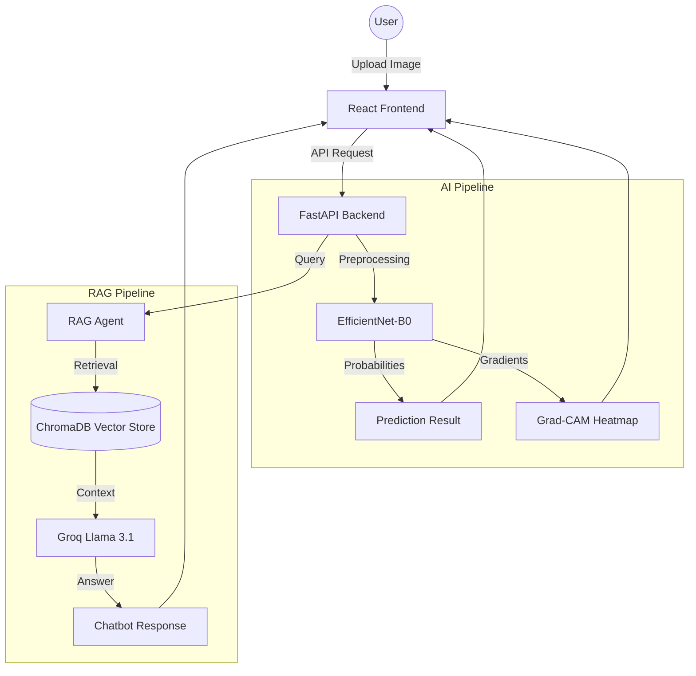

# AI Skin Cancer Detection System 🩺🔬

[](https://fastapi.tiangolo.com/)
[](https://reactjs.org/)
[](https://www.tensorflow.org/)
[](https://groq.com/)
[](https://tailwindcss.com/)

An end-to-end medical AI application that utilizes deep learning to detect potential skin cancer from images and provides an intelligent RAG (Retrieval-Augmented Generation) chatbot for dermatological guidance.

---

## 🌟 Core Modules

### 🧠 1. AI Prediction Engine
Powered by a fine-tuned **EfficientNet-B0** model trained on the **HAM10000** dataset. It accurately classifies skin lesions into 7 diagnostic categories:
- Actinic keratoses and intraepithelial carcinoma (akiec)
- Basal cell carcinoma (bcc)
- Benign keratosis-like lesions (bkl)
- Dermatofibroma (df)
- Melanoma (mel)
- Melanocytic nevi (nv)
- Vascular lesions (vasc)

### 🔍 2. Explainable AI (XAI)
Generates **Grad-CAM heatmaps** to provide transparency. This visualization shows exactly which regions of the skin lesion influenced the AI's prediction, building trust with clinical users and patients.

### ⚖️ 3. Smart Risk Assessment
Goes beyond simple image analysis by incorporating patient-specific metadata:
- Age and Medical History
- Skin Type (Fitzpatrick scale)
- Evolution of the lesion
- AI Confidence scores

### 💬 4. RAG-Powered Chatbot
A specialized dermatological assistant using **LangChain**, **Groq (Llama 3.1)**, and **ChromaDB**. It retrieves context from verified dermatology textbooks to provide evidence-based answers to user concerns.

### 📄 5. Comprehensive Reports
Generates instant, downloadable screening reports that summarize AI findings, heatmaps, and risk factors—ready to be shared with healthcare professionals.

---

## 🛠️ Technology Stack

| Layer | Technologies |
| :--- | :--- |
| **Backend** | Python 3.11, FastAPI, Uvicorn, Pydantic, `uv` package manager |
| **Frontend** | React 19, Vite, Tailwind CSS, Lucide Icons, Framer Motion, TanStack Query |
| **AI/ML** | TensorFlow/Keras (EfficientNet-B0), NumPy, Pillow, OpenCV |
| **LLM & RAG** | Groq API (Llama 3.1), ChromaDB, Sentence Transformers, LangChain |
| **DevOps** | Docker (Optional), Environment Management via `.env` |

---

## 🏗️ Architecture Overview



---

## 🚀 Quick Start

### 1. Prerequisites
- **Python 3.11+** (Managed with [uv](https://github.com/astral-sh/uv) recommended)
- **Node.js 18+**
- **Groq API Key** (Obtain from [Groq Console](https://console.groq.com/))

### 2. Backend Setup
```bash
cd backend
# Install dependencies using uv
uv sync

# Setup environment variables
echo "GROQ_API_KEY=your_groq_api_key_here" > .env

# Run the backend server
uv run uvicorn app.main:app --reload --port 8000
```

### 3. Frontend Setup
```bash
cd frontend
# Install dependencies
npm install

# Run the development server
npm run dev
```
Open [http://localhost:5173](http://localhost:5173) in your browser.

---

## 📂 Project Structure

```text
skin-scan-ai/
├── backend/
│   ├── app/                # FastAPI Application
│   │   ├── api/            # API Routes (Predict, Heatmap, Risk, etc.)
│   │   ├── core/           # Config, Logging, Security
│   │   ├── models/         # ML Inference & Preprocessing
│   │   ├── rag/            # Vector store logic & PDF processing
│   │   └── services/       # Business logic (Report generation, Risk calc)
│   ├── knowledge/          # Medical textbooks for RAG
│   ├── model/              # Trained weights (efficientnet_ham10000.keras)
│   └── chroma_db/          # Persistent vector database
└── frontend/               # React + Vite Project
    ├── src/
    │   ├── components/     # UI Components (Cards, Uploaders, UI kit)
    │   ├── pages/          # Full page views (Prediction, Heatmap, etc.)
    │   └── utils/          # API services & helpers
```

---

## ⚠️ Medical Disclaimer

**This application is for educational and screening purposes ONLY.** 
It is not a diagnostic tool and must not be used as a substitute for professional medical advice, diagnosis, or treatment. The AI's accuracy is limited by its training data and may produce false positives or false negatives. Always seek the advice of a qualified dermatologist for any skin concerns.

---

**Developed with ❤️ for Medical AI Research**
**Dataset:** HAM10000 - "Human Against Machine with 10000 training images"

